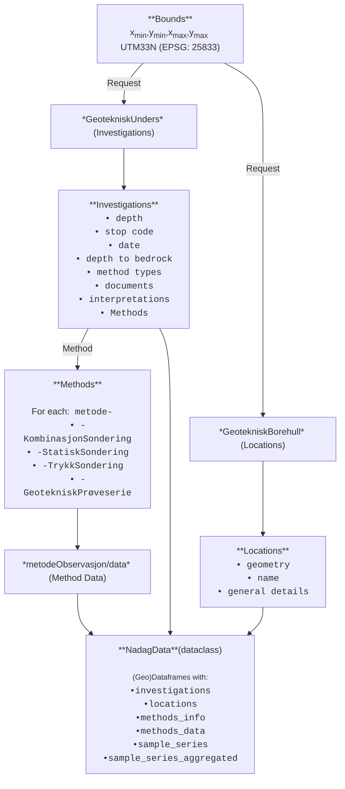

# My interpretation of the NADAG's API datamodel

## General overview
The NADAG API is based on the OGC API - Features standard, which provides a RESTful interface for accessing geospatial data. The API allows users to query and retrieve geotechnical data in various formats, such as GeoJSON, and HTML.

[`NADAG: Grunnundersøkelser - utvidet full model`][api-base] - Base URL for the NADAG API, which provides access to various collections of geotechnical data.

The data modell consists of several collections, such as `GeotekniskUnders`, `GeotekniskBorehull` and `GeotekniskBorehullUnders` (not confusing at all :sweat_smile:), each containing data that can be queried geographically. The API supports various query parameters for filtering and retrieving specific data based on criteria such as location, date, and type of investigation.

## Collections and their relationships

`GeotekniskUnders`: Collection containing geotechnical investigations areas, which are defined by a polygon and have a unique ID. These areas can contain multiple boreholes `GeotekniskBorehull` ([`GeotekniskUnders Example`][unders-example]). This collections has information about the investigation, such as the dates, the client, the responsible company and the project name and number. It has also links to the Documents related to the investigation (it can be whatever, relevant or not, from data reports to cpt calibration sheets, and random profiles and images).

`GeotekniskBorehull`: Collection containing boreholes, which are defined by a point and have a unique ID. Each borehole can contain an ( *and just one?* ) investigation `GeotekniskBorehullUnders` ([`GeotekniskBorehull Example`][borehull-example]). This collection has information about the borehole, such as the location (x, y and z), the depth, whether it drilled into bedrock (and if so, at how deep and whether it was confirmed or just assumed), it has also information related to quick clay identification.

`GeotekniskBorehullUnders`: Collection containing investigations related to a borehole, which are defined by a point and have a unique ID. This collection has information about the investigation, such as the type of investigation - e.g. `KombinasjonSondering` (aka Total Sounding / *totalsondering* - `tot`), `StatiskSondering` (aka Rotary Pressure Sounding / *dreietrykksondering* - `rp`),  `TrykkSondering` (aka CPT/CPT-u - `cpt`), `GeotekniskPrøveserie` (aka Samples - `sa`), and others not relevant for our purposes ( *yet?* ) - and some repetition of data from `GeotekniskBorehull` (why it isn't just one collection, or what are the differences? I don't know :man_shrugging:) ([`GeotekniskBorehullUnders Example`][borehullunders-example]). The data related to the actual investigation is stored in the `metode-XXX` field, where `XXX` is the type of investigation e.g. `metode-KombinasjonSondering`, `metode-StatiskSondering`, `metode-TrykkSondering`, `metode-GeotekniskPrøveserie` (Why not just have a `data` field with the relevant data for each investigation?, I don't know :man_shrugging:). 

Each `metode` links to the information of the investigation, but it is just a container to another link to the actual data, which is stored in the `xxxObservasjon` being `xxx` a different spelling of the method, e.g. `kombinasjonSonderingObservasjon`, `statiskSonderingObservasjon`, `trykksonderingObservasjon`, and `geotekniskproveseriedeldata` (why the inconsistency? :man_shrugging: shouldn't it always be `xxxSonderingObservasjon` with small first letter and capital S? why is all small caps in `geotekniskproveseriedeldata`, why does it end now in 'data' and not 'Observasjon'? ).

Sample data is particular since it is composed of `GeotekniskPrøveserie`, `GeotekniskPrøveserieDel` and `GeotekniskPrøveseriedelData`. The `GeotekniskPrøveserie` is the general information about the sample series of the borehole (different methods, different depths, etcs), the `GeotekniskPrøveserieDel` is the general information about each sample (from, to, sampling method), and the `GeotekniskPrøveseriedelData` is the actual test data of each sample (different test methods, descriptions, etc).

  [api-base]: https://geo.ngu.no/api/features/grunnundersokelser_utvidet/collections
  [unders-example]: https://geo.ngu.no/api/features/grunnundersokelser_utvidet/collections/geotekniskunders/items/9f1d4f48-a85c-4462-98fd-f8a182d21642
  [borehull-example]: https://geo.ngu.no/api/features/grunnundersokelser_utvidet/collections/geotekniskborehull/items?opprinneligGeotekniskUndersID=9f1d4f48-a85c-4462-98fd-f8a182d21642
  [borehullunders-example]: https://geo.ngu.no/api/features/grunnundersokelser_utvidet/collections/geotekniskborehullunders/items?underspkt_fk=07a2ef48-fb91-44f9-bfab-0e50a52a4f76

### Workflow for retrieving data

> **Important note**: Sometimes columns representing "the same" kind of data have inconsisten naming across different method types. For example, the penetration force is represented in `metode-KombinasjonSondering` and `metode-TrykkSondering` as `anvendtLast`, while in `metode-StatiskSondering` it is represented as `anvendtlast`. This can lead to confusion and difficulties when trying to analyze the data, since it requires additional steps to standardize the column names across different method types. It would be ideal if the NADAG API had a more consistent naming convention for columns representing similar data across different method types. 
> 
> **Question for the NADAG team**: WHYYYYYYYYYYYYYYYYYYYYYYYYYYYYYYYYYYYYY?! :sob: