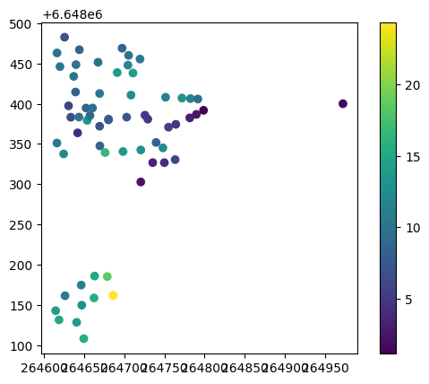

# Introduction to the Nadag API python client

This Python library provides a client and processing toolkit for retrieving geotechnical data from the Norwegian National Database for Ground investigations (NADAG) using its API. The library is mainly focused on retrieving and processing data related to geotechnical investigations, such as boreholes, soil samples, and laboratory tests, to be used as part of NVE's geotechnical data processing and analysis workflows, mainly as part of R&D project PROAKTIV and GRUNDIG.


## Examples
### Fetching data from NADAG API from bounding box in Oslo

``` python title="Fetching data from NADAG API from bounding box"
from nadag_python.nadag_functions import fetch_from_bounds

bounds = [264612.0928,6648079.8379,265116.4644,6648453.309] # [minx, miny, maxx, maxy]
nadag_data = await fetch_from_bounds( bounds=bounds)
print(nadag_data)

# Output:
#
# NadagData(
#   bounds = (264612, 6648079, 265116, 6648453),
#   fetched_at = 2026-02-24 10:43:41,
#   locations = 691,
#   investigations = 695,
#   methods_info = 89,
#   methods_data = 31120,
#   test_series_data = 72,
#   test_series_aggregated = 14
# )

```

`#!python nadag_data.investigations.plot(column='boretLengdeTilBerg.borlengdeTilBerg', legend=True)`

This plots the depth to bedrock (`boretLengdeTilBerg.borlengdeTilBerg`) of the investigations in the area.


